# Flujo Git y BMad para lavaclean

Este proyecto usa un flujo tipo GitFlow ligero, con `main` como rama de produccion y `develop` como rama de integracion.

## Objetivo

- Mantener `main` siempre estable y desplegable.
- Centralizar el trabajo en `develop`.
- Hacer cada cambio en una rama corta y acotada.
- Usar BMad como contrato de trabajo, no como simple nota suelta.
- Separar implementacion, revision y promocion a produccion.
- Tener una validacion automatica minima en GitHub para cada PR.

## Mapa de ramas

| Rama | Uso | Regla |
|------|-----|-------|
| `main` | Produccion | Solo recibe merges aprobados |
| `develop` | Integracion | Recibe features validadas |
| `feature/<id>-<tema>` | Trabajo normal | Una rama por historia o cambio |
| `bugfix/<id>-<tema>` | Correccion no urgente | Se abre desde `develop` |
| `hotfix/<id>-<tema>` | Correccion urgente | Se abre desde `main` y luego vuelve a `develop` |

## Flujo recomendado

```mermaid
flowchart LR
  A[PRD / Epica / Story BMad] --> B[Crear rama desde develop]
  B --> C[Codex implementa]
  C --> D[Pruebas locales]
  D --> E[Claude revisa]
  E --> F[Pull Request a develop]
  F --> G[Merge a develop]
  G --> H[Release candidate]
  H --> I[Pull Request de develop a main]
  I --> J[Merge a main]
  J --> K[Tag de version]
```



## Regla de trabajo diaria

1. Tomar una story o cambio pequeno de BMad.
2. Crear una rama nueva desde `develop`.
3. Implementar en esa rama.
4. Ejecutar pruebas locales y correcciones.
5. Pedir revision de Claude sobre la misma rama.
6. Abrir PR hacia `develop`.
7. Fusionar solo cuando pruebas y revision esten verdes.
8. Cuando varias historias queden listas, promover `develop` a `main`.

## Roles de Codex y Claude

- Codex: implementa la historia, corrige fallos y deja el cambio listo para PR.
- Claude: revisa el cambio, encuentra riesgos, propone ajustes y puede apoyar en refactor puntual.
- Un cambio no debe tener dos ramas activas con el mismo objetivo al mismo tiempo.
- Si Claude propone un ajuste grande, se aplica sobre la misma feature branch o se abre una rama derivada, pero nunca directo a `main`.

## Relacion con BMad

- BMad define el trabajo valido: PRD, arquitectura, epics, stories y validaciones.
- La story es la unidad de implementacion.
- La rama debe reflejar una sola story o un solo cambio acotado.
- Si el alcance crece, se corta el trabajo antes de mezclarlo con otros cambios.

## Convenciones de ramas

Usa nombres cortos y trazables.

- `feature/4-1-open-shift`
- `feature/4-2-charge-note`
- `bugfix/print-ticket-footer`
- `hotfix/login-admin-lockout`

Reglas:

- Usa kebab-case.
- Si existe ID de story o issue, ponlo al inicio.
- No mezcles dos objetivos independientes en la misma rama.

## Convenciones de commits

- Un commit por cambio logico.
- Mensajes en modo imperativo.
- Prefijo sugerido:
  - `feat:`
  - `fix:`
  - `refactor:`
  - `test:`
  - `docs:`
  - `chore:`

Ejemplos:

- `feat: add shift closing validation`
- `fix: prevent duplicate admin login`
- `docs: describe git workflow`

## Pull requests

Cada PR debe traer:

- Resumen breve del cambio.
- Link a la story o documento BMad.
- Pruebas ejecutadas.
- Riesgos y rollback si aplica.
- Capturas o evidencia si la UI cambio.

Regla operativa:

- Feature branch -> PR a `develop`.
- Release branch o PR de integracion -> PR a `main`.
- Hotfix branch -> PR directo a `main` y luego back-merge a `develop`.

## Proteccion de ramas en GitHub

Configura esto en el repositorio remoto. La referencia detallada esta en [docs/github-setup.md](/c:/Users/jorge/source/repos/lavaclean/docs/github-setup.md).

### `main`

- Require a pull request before merging.
- Require at least 1 approval.
- Dismiss stale approvals when new commits are pushed.
- Require conversation resolution.
- Require status checks to pass before merging.
- Block force pushes.
- Block branch deletion.
- Restrict who can push.

### `develop`

- Require a pull request before merging.
- Require at least 1 approval.
- Require status checks to pass before merging.
- Dismiss stale approvals when new commits are pushed.
- Block force pushes.
- Block branch deletion.

## Politica de promocion

1. El trabajo nuevo entra por ramas `feature/*` o `bugfix/*`.
2. Todo pasa primero por `develop`.
3. Solo se promueve a `main` cuando la integracion esta estable.
4. `main` se etiqueta con version semantica o version interna del release.
5. Si sale un hotfix, se corrige en `hotfix/*`, se mezcla a `main` y se replica a `develop`.

## Validacion automatica

El workflow de referencia es [.github/workflows/repo-sanity.yml](/c:/Users/jorge/source/repos/lavaclean/.github/workflows/repo-sanity.yml).

- Se ejecuta en `pull_request` y `push` sobre `develop` y `main`.
- Instala dependencias con Yarn.
- Corre `yarn ci`.
- Ese check se debe exigir en la proteccion de ramas.

## Checklist rapido

- [ ] La rama parte de `develop` o `main` segun el tipo de cambio.
- [ ] El nombre de la rama describe un solo objetivo.
- [ ] La story BMad esta clara.
- [ ] Se ejecutaron pruebas locales.
- [ ] Claude reviso el cambio o dejo observaciones.
- [ ] El PR fue abierto contra la rama correcta.
- [ ] `main` solo recibe cambios ya probados.

## Comandos utiles

```bash
git checkout develop
git pull
git checkout -b feature/4-2-charge-note
git push -u origin feature/4-2-charge-note
```

```bash
git checkout main
git pull
git checkout -b hotfix/admin-login-lockout
```

```bash
git tag v1.0.0
git push origin v1.0.0
```
